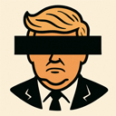

# DETRUMP Chrome Extension

<p align="center">
  
</p>

A Chrome extension that automatically detects and covers any text mentioning Trump with a black overlay. When users hover over the covered text, a tooltip appears indicating that the content has been hidden.

## Features

- Automatically detects and covers mentions of "Trump", "Trumps", "Donald Trump", or "Donald Trumps" (case-insensitive)
- Real-time content scanning for dynamically loaded content
- Hover tooltips to indicate hidden content
- Minimal performance impact
- Works on all websites

## Installation

### From Chrome Web Store
*(Coming soon)*

### Manual Installation
1. Download or clone this repository
2. Open Chrome and navigate to `chrome://extensions/`
3. Enable "Developer mode" in the top right
4. Click "Load unpacked" and select the `release/detrump-extension` directory

## Development

### Project Structure
```
release/detrump-extension/
├── manifest.json      # Extension configuration
├── content.js        # Main content script
├── styles.css        # Styling for covered text
├── icons/           # Extension icons
└── screenshots/     # Extension screenshots
```

### Requirements
- Chrome Browser
- Developer mode enabled in Chrome extensions

### Testing
1. Open `test.html` or `test_detailed.html` in your browser
2. The extension should automatically cover all Trump-related text
3. Hover over covered text to see tooltips

## Contributing
Contributions are welcome! Please feel free to submit a Pull Request.

## License
This project is licensed under the terms included in the LICENSE file.

## Privacy
This extension operates entirely client-side and does not collect or transmit any data.
